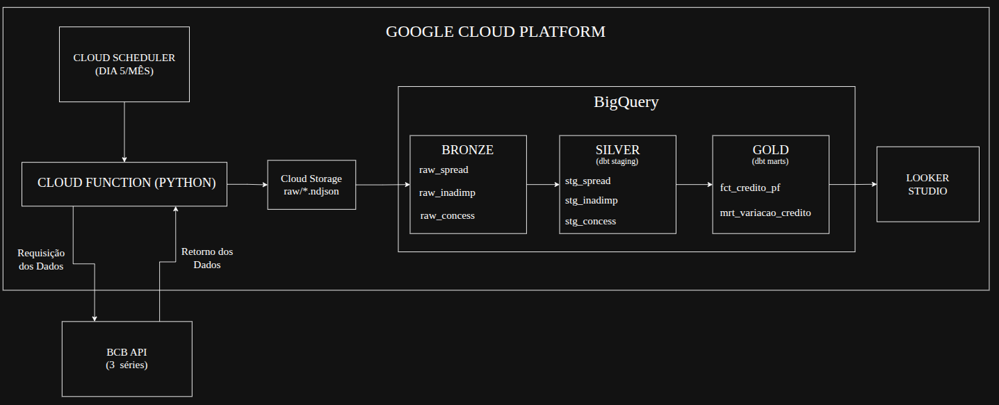

# GCP Pipeline — Brazilian Consumer Credit Monitor

End-to-end ELT pipeline that ingests credit health indicators from Brazil's Central Bank (BCB) API, loads into Google Cloud Platform, transforms with dbt, and delivers a Looker Studio dashboard.

**Question it answers:** "Is consumer credit in Brazil getting more expensive and riskier?"

## Architecture



## Medallion Architecture

| Layer | Implementation | Purpose |
|---|---|---|
| **Bronze** | `raw/` in GCS + `raw_*` tables in BigQuery | Raw data exactly as received from API (all STRING) |
| **Silver** | `stg_*` dbt views | Type casting (DATE, FLOAT64, INT64), column renaming |
| **Gold** | `fct_*` and `mrt_*` dbt views | Joined fact table, monthly variation %, 3-month moving averages — dashboard-ready |

Each layer depends only on the previous one, with a clear responsibility: store, clean, aggregate.

## Data Sources

Three monthly series from BCB's SGS API (public, no auth required):

| Indicator | SGS Code | Unit | Description |
|---|---|---|---|
| Spread Bancário PF | 20783 | % (p.p.) | Bank spread for consumer credit |
| Inadimplência PF | 21082 | % | Default rate on consumer loans |
| Concessões PF | 20631 | R$ millions | New consumer credit issued |

Data range: March 2011 — present (~180 monthly records)

## Data Model

| Layer | Tables | What it does |
|---|---|---|
| **Raw** (BigQuery) | `raw_spread`, `raw_inadimplencia`, `raw_concessoes` | Mirror of API response — `data` and `valor` as STRING |
| **Staging** (dbt views) | `stg_spread`, `stg_inadimplencia`, `stg_concessoes` | Type casting: STRING → DATE, FLOAT64/INT64 |
| **Marts** (dbt views) | `fct_credito_pf`, `mrt_variacao_credito` | Joined fact table + monthly variation %, 3-month moving averages |

## Dashboard

Built in Looker Studio, connected directly to BigQuery:

- **Scorecards:** Latest values for spread (21.84%), default rate (4.33%), and new credit issued (R$ 732,939 mi)
- **Time series 1:** Spread + default rate (%) over time
- **Time series 2:** Credit concessions (R$ millions) over time

## Tech Stack

| Tool | Purpose |
|---|---|
| **Python 3.13** | Extract + Load (API calls, GCS upload, BigQuery load) |
| **Google Cloud Storage** | Data lake — stores raw JSON from API |
| **BigQuery** | Data warehouse — stores and serves all tables |
| **dbt-core** | Transform layer — staging models + marts (SQL) |
| **Looker Studio** | Dashboard and visualization |
| **Cloud Functions (gen2)** | Serverless pipeline execution |
| **Cloud Scheduler** | Monthly cron trigger (day 5, 10:00 BRT) |
| **uv** | Python dependency management |

## How to Run

### Prerequisites

- GCP account with billing enabled
- `gcloud` CLI installed and authenticated
- Python 3.13+ and `uv`

### Setup

```bash
# clone and install dependencies
git clone <repo-url>
cd gcp-pipeline-credito
uv sync

# authenticate with GCP
gcloud auth login
gcloud config set project credito-pipeline-br
gcloud auth application-default login

# create GCP resources
gcloud storage buckets create gs://credito-pipeline-raw-br --location=us-east1
bq mk --dataset --location=us-east1 credito-pipeline-br:credito
```

### Run the pipeline locally

```bash
# extract (BCB API) → load (GCS → BigQuery)
uv run main.py

# transform (dbt staging + marts)
cd dbt_credito
uv run dbt run --profiles-dir .

# run tests
uv run dbt test --profiles-dir .
```

### Deploy to cloud (optional)

```bash
# deploy cloud function
gcloud functions deploy ingest-credito --gen2 --runtime python313 --region us-east1 --source ./cloud_function --entry-point ingest_credito --trigger-http --allow-unauthenticated

# create monthly scheduler
gcloud scheduler jobs create http credito-mensal --location us-east1 --schedule "0 10 5 * *" --uri <FUNCTION_URL> --http-method GET --time-zone "America/Sao_Paulo"
```

## Project Structure

```
gcp-pipeline-credito/
├── src/
│   ├── extract_data.py        # BCB API → local JSON
│   ├── load_gcs.py            # JSON → NDJSON → Cloud Storage
│   └── load_bigquery.py       # GCS → BigQuery raw tables
├── cloud_function/
│   ├── main.py                # Serverless entry point (same pipeline)
│   └── requirements.txt
├── dbt_credito/
│   ├── models/
│   │   ├── staging/           # stg_spread, stg_inadimplencia, stg_concessoes
│   │   └── marts/             # fct_credito_pf, mrt_variacao_credito
│   ├── dbt_project.yml
│   └── profiles.yml
├── main.py                    # Local pipeline runner
├── pyproject.toml
└── .gitignore
```

## What I Learned

- **ELT vs ETL:** Loading raw data first and transforming inside the warehouse with dbt — compared to my previous projects where I transformed with Python/Pandas before loading
- **dbt:** Sources, staging/marts pattern, window functions (LAG, moving averages), automated testing
- **GCP services:** Cloud Storage as data lake, BigQuery as warehouse, Cloud Functions + Scheduler for serverless automation
- **Medallion architecture:** Raw → Staging → Marts, each layer with a clear purpose
- **NDJSON:** BigQuery requires newline-delimited JSON, not standard JSON arrays
